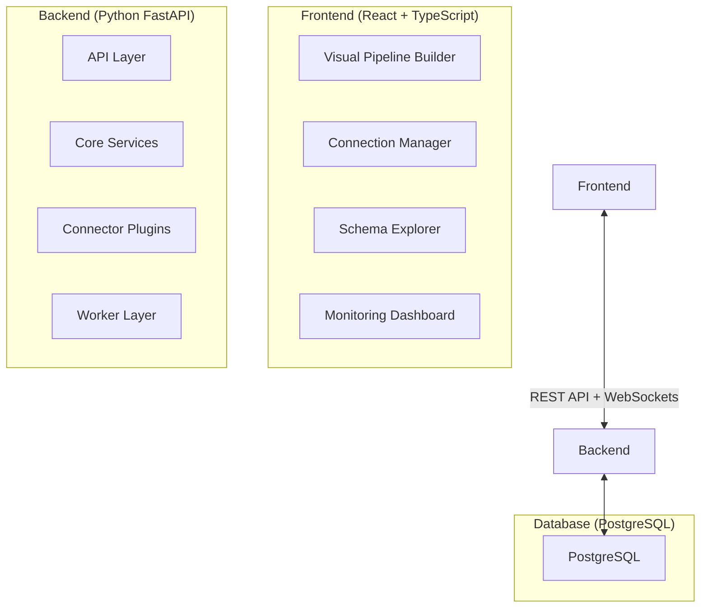

# Architecture & Design

## Overview
We are building a production-grade, self-hosted data integration platform (similar to Airbyte/Meltano but lighter and with superior UX) that enables users to:

- Connect to any data source (databases, APIs, files, cloud storage)
- Extract data with intelligent scheduling and incremental syncs
- Load data to any destination
- Monitor pipelines in real-time with beautiful visualizations
- Manage everything through an intuitive web interface

**Target User:** Mid-to-large organizations that need local/on-premise ETL without vendor lock-in or SaaS dependencies.

## System Architecture

### System Components

### Backend Components
-   **API Layer (FastAPI):**
    -   Connection CRUD
    -   Pipeline Management
    -   Job Orchestration
    -   Real-time Updates (WebSockets)
-   **Core Services:**
    -   Encryption Service (Master Password + DEK)
    -   Plugin System (Connector Factory)
    -   Metadata Scanner (Schema Discovery)
    -   State Manager (Incremental Sync Tracking)
-   **Connectors (Plugin-Based):**
    -   **Sources:** PostgreSQL, MySQL, MSSQL, MongoDB, Oracle, REST APIs, Files, S3, etc.
    -   **Destinations:** PostgreSQL, Snowflake, BigQuery, S3, Parquet/CSV, Kafka, etc.
-   **Worker Layer (Celery + Redis):**
    -   Metadata Extraction Jobs
    -   Data Extraction Jobs (with batching)
    -   Pipeline Scheduling (CRON, managed via custom database-driven Celery Beat scheduler)

## Data Models (Database Schema)

### Core Tables

1.  **`connections`**
    -   Stores all source/destination connection details.
    -   `config_encrypted`: JSON blob with credentials (encrypted).
    -   `connector_type`: Enum (postgresql, mysql, s3, etc.).
    -   `is_source`: Boolean (source vs destination).

2.  **`pipelines`**
    -   Defines source → destination data flows.
    -   `source_connection_id` / `destination_connection_id`.
    -   `source_config`: JSON (tables, custom SQL, filters).
    -   `destination_config`: JSON (target table, write mode).
    -   `schedule_cron`: CRON string for scheduling.
    -   `sync_mode`: Enum (full_refresh, incremental, append).

3.  **`pipeline_states`**
    -   Tracks incremental sync position.
    -   `state_data`: JSON (last cursor value, timestamp).

4.  **`jobs`**
    -   Individual pipeline execution instances.
    -   `status`: Enum (pending, running, success, failed).
    -   `records_extracted`, `records_loaded`, `records_failed`.

5.  **`job_logs`**
    -   Detailed logs per job.

6.  **`metadata_cache`**
    -   Caches discovered schemas (tables, columns, relationships).

## Data Flow

### Pipeline Execution Lifecycle

1.  **User Creates Pipeline:** Configures source, destination, and schedule via UI/API.
2.  **Scheduler Triggers Job:** Celery Beat enqueues task based on CRON.
3.  **Extract Data:**
    -   Worker decrypts credentials.
    -   Source connector executes query (handling incremental state).
    -   Records are yielded in batches.
4.  **Load Data:**
    -   Destination connector writes records (batch inserts/file writes).
5.  **Update State:**
    -   New cursor value is saved to `pipeline_states`.
6.  **Finalize:**
    -   Job status updated to "success".
    -   WebSocket notification sent.

## Security Architecture
**Master Password + DEK (Data Encryption Key) Model:**
1.  User creates a Master Password (never stored, kept in session memory).
2.  System generates a random DEK (32-byte Fernet key).
3.  Master Password encrypts the DEK using PBKDF2 (100k iterations).
4.  Encrypted DEK stored in database.
5.  All connection credentials encrypted with DEK before storage.
6.  User must "unlock" system with Master Password on startup.

**Result:** Even if the database is compromised, credentials are safe without the Master Password.
